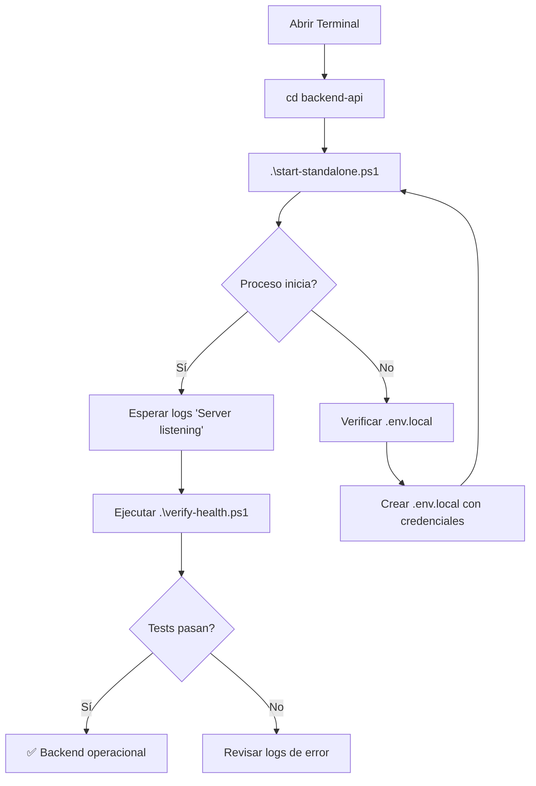

# Rural24 Backend API - Guía de Ejecución

## 🚨 REGLA CRÍTICA

**El backend funciona de 2 formas:**

### ✅ Opción 1: Con Turbo (RECOMENDADO - Full Stack)
```powershell
cd c:\Users\German\rural24
npm run dev
```
- Levanta Frontend (5173) + Backend (3000) simultáneamente
- Ideal para desarrollo full stack
- **AHORA FUNCIONA CORRECTAMENTE** con arquitectura corregida

### ✅ Opción 2: Standalone (Solo Backend)
```powershell
cd c:\Users\German\rural24\backend-api
.\start-standalone.ps1
```
- Solo backend, sin frontend
- Útil para debugging backend aislado
- Más rápido para desarrollo de API

---

## 📁 Arquitectura de Scripts

### Modo Desarrollo (Sin Watch)
```powershell
cd backend-api
npm run dev
```
- Ejecuta `tsx src/server.ts`
- Proceso estable, sin hot reload
- Ideal para debugging y tests

### Modo Desarrollo (Con Watch)
```powershell
cd backend-api
npm run dev:watch
```
- Ejecuta `tsx watch src/server.ts`
- Hot reload en cambios
- Puede tener race conditions en Windows

### Modo Test Mínimo
```powershell
cd backend-api
npm run dev:test
```
- Ejecuta `tsx src/index.ts`
- Servidor mínimo para aislar problemas

### Modo Producción
```powershell
cd backend-api
npm run build
npm start
```
- Compila TypeScript → dist/
- Ejecuta `node dist/server.js`

---

## 🔍 Verificación de Salud

### Script Automatizado
```powershell
cd backend-api
.\verify-health.ps1
```

Verifica:
- ✓ Procesos Node activos
- ✓ Puerto 3000 en LISTEN
- ✓ Endpoint `/api/health` responde
- ✓ `.env.local` existe
- ✓ `node_modules` instalados

### Verificación Manual
```powershell
# 1. Puerto escuchando
Get-NetTCPConnection -LocalPort 3000 -State Listen

# 2. Procesos Node
Get-Process -Name node

# 3. Test endpoint
Invoke-RestMethod http://localhost:3000/api/health

# 4. Con curl
curl http://localhost:3000/api/health
```

---

## 🐛 Troubleshooting

### Problema: "Port 3000 already in use"
```powershell
# Matar procesos Node
Stop-Process -Name node -Force

# Verificar puerto libre
Get-NetTCPConnection -LocalPort 3000
```

### Problema: "Cannot find module .env.local"
```powershell
# Verificar working directory
Get-Location  # Debe ser backend-api/

# Verificar archivo existe
Test-Path .env.local
```

### Problema: "Server logs say listening but curl fails"
```powershell
# El proceso murió después de imprimir logs
# Verificar que el proceso sigue vivo:
Get-Process -Name node

# Si no hay procesos → revisar logs de error en tsx
# Si hay procesos pero no escuchan → problema de bind
```

---

## 📊 Flujo Correcto de Inicio



---

## 🎯 Checklist de Validación

Antes de reportar un problema, verificar:

- [ ] Estoy en `backend-api/` (no en `rural24/`)
- [ ] Existe `.env.local` con credenciales Supabase/Cloudinary
- [ ] `node_modules` está instalado (`npm install`)
- [ ] Puerto 3000 está libre (no usado por otra app)
- [ ] No hay errores TypeScript (`npm run type-check`)
- [ ] El script `verify-health.ps1` pasa todos los tests

---

## 🚀 Quick Start (Desde Cero)

```powershell
# 1. Ir al backend
cd c:\Users\German\rural24\backend-api

# 2. Instalar dependencias (si es primera vez)
npm install

# 3. Verificar .env.local existe
if (!(Test-Path .env.local)) {
    Write-Host "ERROR: Copy .env.example to .env.local"
    exit 1
}

# 4. Iniciar servidor
.\start-standalone.ps1

# 5. En otra terminal, verificar
.\verify-health.ps1

# 6. Probar endpoint
curl http://localhost:3000/api/health
```

---

## 📝 Notas Importantes

### Por Qué NO Usar Turbo Directamente

Turbo es un **task runner para monorepos** que:
- Coordina múltiples workspaces (frontend + backend)
- Cachea outputs
- Mata procesos que considera "idle"
- Puede interferir con procesos long-running

**Solución:** Scripts standalone que evitan Turbo para backend.

### Por Qué Garantizar Working Directory

El backend necesita:
- Cargar `.env.local` desde `backend-api/.env.local`
- Resolver rutas relativas desde `backend-api/`
- Acceder a `node_modules` local

Si se ejecuta desde `rural24/`, los paths se resuelven mal.

### Por Qué el Proceso Debe Mantenerse Vivo

Un servidor HTTP necesita:
- Event loop activo (garantizado por TCP server)
- Handlers de señales (SIGINT, SIGTERM) para shutdown graceful
- Error handlers globales (unhandledRejection, uncaughtException)

Si el script llega al final sin nada async pendiente, Node termina.
Fastify mantiene el event loop vivo automáticamente con `listen()`.
